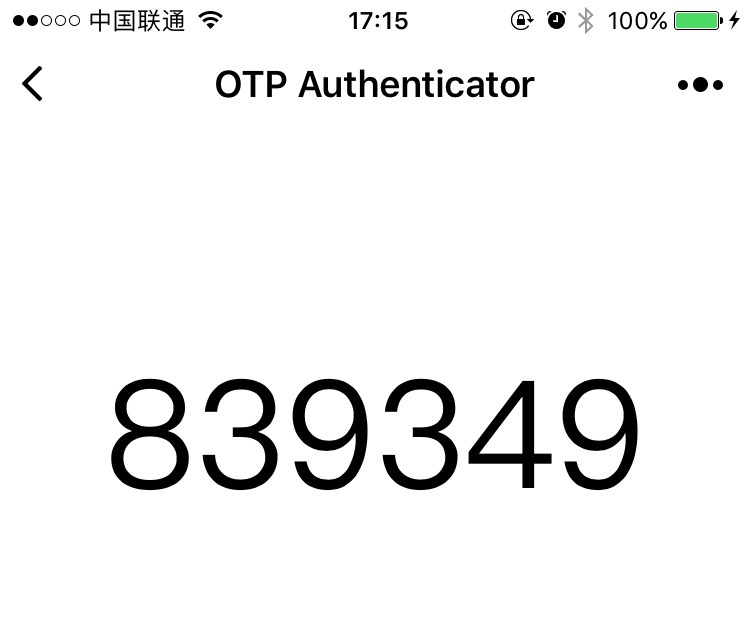

# wxapp-otp
微信小程序 OTP 专用库，Port from node-notp and CryptoJS.  
This is a library port from ``node-notp`` and ``CryptoJS`` to adapt to **WeChat Mini Program** runtime.  

这是一个用于微信小程序的 OTP 库，包含两种算法：
* HOTP (counter based one time passwords) 
* TOTP (time based one time passwords)

是对已有开源库进行修改从而才能够运用到微信小程序之中，感谢  
Thanks to these open source library authors  
* [Node One Time Password library](https://github.com/guyht/notp)
* [crypto-js](https://code.google.com/archive/p/crypto-js/)

#### DEMO

#### 使用方法 Usage
1. ``git clone https://github.com/THaGKI9/wxapp-otp.git`` 下载
2. 将 ``lib`` 文件夹下的 ``node-notp.js`` 和 ``crypto-js.js`` 复制到微信小程序项目目录下
3. 引用并使用

#### 文档 Documentation
[Node One Time Password library](https://github.com/guyht/notp)

